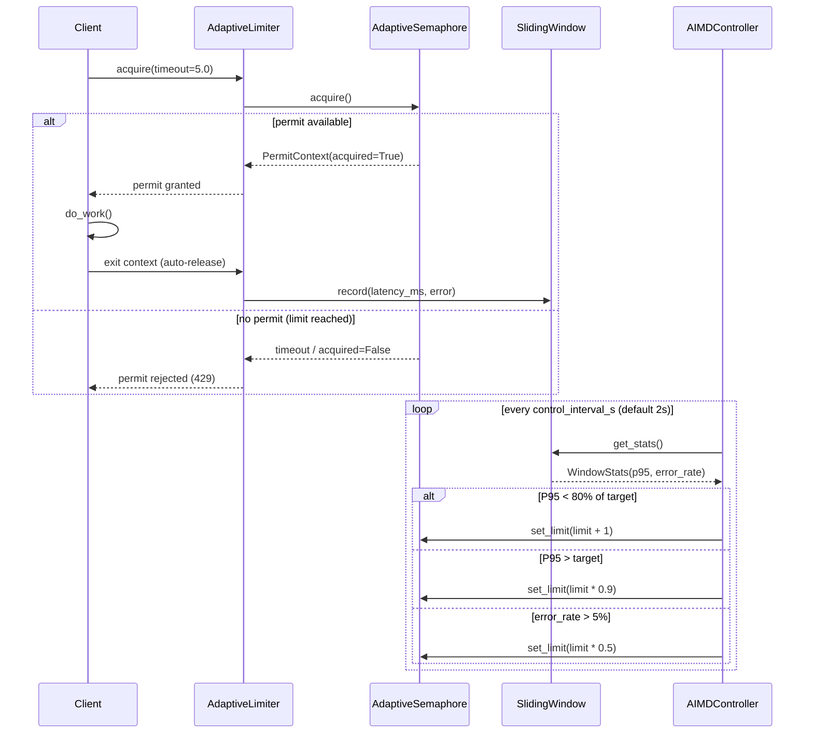

# Architecture: Adaptive Concurrency Limiter

## Overview

The `adaptive-limiter` is a pure-Python library and CLI tool that implements **Adaptive Concurrency Control** using the **AIMD (Additive Increase, Multiplicative Decrease)** algorithm—the same algorithm that powers TCP congestion control. It dynamically adjusts the maximum number of concurrent in-flight requests based on real-time latency and error-rate feedback.

The tool ships with a simulation harness (`python -m src.main`) that generates synthetic workloads and visualises how the limiter responds to traffic spikes, chaos, and saturation scenarios.

**Runtime:** Python 3.10+ | **Dependencies:** None (pure standard library)

---

## Component Diagram

```mermaid
flowchart TD
    CLI["CLI Entry Point\nsrc/main.py"] --> SIM["WorkloadSimulator\nsrc/simulator/workload.py"]
    CLI --> CTRL["AIMDController\nsrc/limiter/controller.py"]
    CLI --> MET["MetricsCollector\nsrc/metrics/collector.py"]

    SIM --> BACKEND["BackendSimulator\n(latency + error model)"]
    SIM --> TGEN["TrafficGenerator\n(pattern + RPS)"]

    CTRL --> SEM["AdaptiveSemaphore\nsrc/limiter/semaphore.py"]
    CTRL --> WIN["SlidingWindow\nsrc/limiter/window.py"]

    WIN -->|P95 latency, error rate| CTRL
    SEM -->|in-flight count| CTRL
    CTRL -->|set_limit()| SEM

    MET --> REPORT["ConsoleReporter\n(live table output)"]
    MET --> EXPORT["JSON Export\n(optional)"]
```

---

## Sequence Diagram: Request Lifecycle



---

## Components

| Component | File | Responsibility |
|-----------|------|----------------|
| `AdaptiveLimiter` | `src/limiter/controller.py` | High-level API; owns controller lifecycle |
| `AIMDController` | `src/limiter/controller.py` | AIMD decision loop; emits `ControllerEvent` |
| `AdaptiveSemaphore` | `src/limiter/semaphore.py` | Counting semaphore with runtime-adjustable limit |
| `SlidingWindow` | `src/limiter/window.py` | Time-windowed latency + error statistics |
| `WorkloadSimulator` | `src/simulator/workload.py` | Generates synthetic traffic at configurable RPS |
| `BackendSimulator` | `src/simulator/workload.py` | Emulates service latency distributions |
| `TrafficGenerator` | `src/simulator/workload.py` | Produces traffic patterns (steady, spike, chaos) |
| `Scenario` | `src/simulator/scenarios.py` | Named test scenario with preset workload config |
| `MetricsCollector` | `src/metrics/collector.py` | Aggregates snapshots; exports to JSON |
| `ConsoleReporter` | `src/metrics/collector.py` | Live-updates terminal table with current stats |
| `main()` | `src/main.py` | CLI entry point; parses args, runs simulation |

---

## Data Flow

1. **CLI parses arguments** (`--scenario`, `--duration`, `--target-latency`, etc.) and builds `WorkloadConfig` + `ControllerConfig`.
2. **AIMDController starts** its async control loop (runs every `control_interval_s`).
3. **TrafficGenerator emits requests** at the configured RPS and pattern.
4. **Each request calls `limiter.acquire()`**, which blocks on the `AdaptiveSemaphore` if at capacity or returns `acquired=False` on timeout.
5. **Granted requests** call `BackendSimulator` which sleeps for a sampled latency and may inject errors.
6. **On completion**, the `SlidingWindow` records `(latency_ms, is_error)` for the time-window.
7. **Every control interval**, `AIMDController` reads P95 latency and error rate from `SlidingWindow` and calls `AdaptiveSemaphore.set_limit(new_limit)`.
8. **MetricsCollector** records a snapshot each interval; `ConsoleReporter` rewrites the terminal table.
9. **On completion**, summary statistics are printed and optionally exported as JSON.

---

## AIMD Decision Table

| Condition | Action | Formula |
|-----------|--------|---------|
| P95 < 80% of target | Increase | `limit += 1` |
| P95 > target | Decrease | `limit = max(min_limit, limit * 0.9)` |
| error_rate > 5% | Backoff | `limit = max(min_limit, limit * 0.5)` |
| 80%–100% of target | Hold | No change |

---

## Usage as Library

```python
from src.limiter import AdaptiveLimiter

limiter = AdaptiveLimiter(target_latency_ms=50.0, min_limit=5, max_limit=100)
await limiter.start()

async with limiter.acquire() as permit:
    if not permit.acquired:
        return Response(status=429)
    result = await process_request()

await limiter.stop()
```
